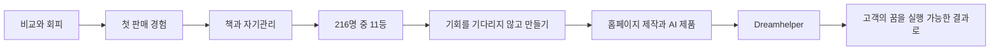

  

  

    
    
    
  

# 김도현 · Dreamhelper

### AI로 사람과 사업의 다음 단계를 설계하고 만드는 Product Builder

고객의 꿈을 듣고, 복잡한 문제를 실행 가능한 홈페이지·도구·제품으로 바꿉니다.
현재는 홈페이지 제작으로 수익을 만들면서 취업과 창업을 함께 준비하고 있습니다.

> **Dreamhelper**는 고객의 목표를 대신 결정하는 사람이 아니라, 목표를 선명하게 만들고 실제 결과까지 함께 만드는 조력자입니다.

## What I am building now

| 방향 | 지금 하는 일 |
| --- | --- |
| **고객의 결과** | 목적을 발견하고 홈페이지를 기획·제작해 실제 수익과 다음 행동으로 연결합니다. |
| **제품 개발** | Next.js, React, FastAPI와 AI API를 조합해 제품 수준의 웹 서비스를 만듭니다. |
| **브랜드 구축** | 홈페이지 제작 사업을 Dreamhelper라는 브랜드로 발전시키고 장기적으로 창업을 준비합니다. |
| **성장 방식** | 고객을 가르치고, 실행한 결과가 눈에 보이는 순간에서 가장 큰 에너지를 얻습니다. |

## My operating system

| 01 · Listen | 02 · Clarify | 03 · Build | 04 · Measure | 05 · Improve |
| :---: | :---: | :---: | :---: | :---: |
| 고객의 말과 맥락을 듣기 | 문제와 우선순위를 선명하게 하기 | 빠르게 제품으로 만들기 | 반응과 결과를 확인하기 | 배운 것을 다음 버전에 반영하기 |

이 루프를 반복해 아이디어를 단순한 화면이 아니라 **사용되고, 측정되고, 개선되는 제품**으로 만듭니다.

## 2026 scorecard

| 영역 | 목표 또는 성과 | 상태 |
| --- | --- | --- |
| 건강 | 허리를 관리하며 탁구할 수 있는 몸 만들기 | 진행 중 |
| 브랜드 | 홈페이지 제작 사업을 Dreamhelper로 브랜드화 | 기반 구축 |
| 학업 | 학점 4.0 이상 | 진행 중 |
| 성장 | 책 50권 읽기 | 진행 중 |
| 수익 | 홈페이지로 월 150만 원 만들기 | 핵심 목표 |

**Priorities:** `건강` → `돈` → `자유` → `열정` → `성장`

## My story

한동안 저는 다른 사람과 비교하며 현실에서의 자신감을 잃고 게임 속으로 도피했습니다.
대학교 1학년 여름, 아버지의 제안으로 네이버에 상품을 등록했고 첫 판매를 경험했습니다.
그때 처음으로 **내가 만든 결과가 실제 가치와 수익으로 이어질 수 있다**는 사실을 배웠습니다.

입대를 앞두고 책을 읽기 시작했고, 훈련과 자기관리를 이어가며 교육훈련 성적을
216명 중 11등까지 끌어올렸습니다. 저는 못하는 사람이 아니라, 아직 해보지 않은 사람일 수
있다는 것을 깨달았습니다.

전역 후에는 마케팅 회사에서 영상 편집 업무로 기회를 만들었고, 프로젝트를 맡으며
문제를 해결하는 힘을 키웠습니다. 이제 그 경험을 홈페이지 제작과 AI 제품으로 확장해
고객의 목표를 현실로 만드는 **Dreamhelper**가 되려 합니다.

## Featured products

### [imweb AI Toolkit · Brand Studio · WebPilot AI](https://github.com/ghimdohyun/imweb-ai-toolkit)

AI agent toolkit과 AI 기반 견적·브랜드 진단·홈페이지 기획 도구를 하나의 저장소에서 운영합니다.
Next.js frontend와 FastAPI backend를 함께 포함한 통합 제품입니다.

### [DreamHelixion Web Builder](https://github.com/ghimdohyun/dreamhelixion-web-builder)

AI 홈페이지 빌더, 프로젝트 관리, 게시·도메인·결제 흐름을 포함한 SaaS입니다.

### [DreamHelixion Planner](https://github.com/ghimdohyun/dreamhelixion-planner)

대학 교육과정·졸업요건을 분석하고 개인화된 학습계획을 추천합니다.

### More products

| Project | What it does | Link |
| --- | --- | --- |
| **Investment AI Assistant** | Claude 기반 데일리 투자 브리핑과 Telegram 전달 자동화 | [GitHub](https://github.com/ghimdohyun/investment-ai-assistant) |
| **Startup Alert** | 스타트업·투자 정보를 수집하고 알림으로 전달 | [GitHub](https://github.com/ghimdohyun/startup-alert) |
| **Fieldlink Facility SaaS** | 시설 운영·현장 업무를 위한 SaaS MVP | [GitHub](https://github.com/ghimdohyun/fieldlink-facility-saas) · [Live](https://fieldlink.dreamhelixion.com/) |
| **Sunfull Program** | Playwright 기반 Windows 데스크톱 자동화 프로그램 | [GitHub](https://github.com/ghimdohyun/sunfull-program) |

## Other projects

- [Auto-Doc Lab](https://github.com/ghimdohyun/auto-doc-lab) · [Live](https://biz.dreamhelixion.com/)
- [Smartstudy Landing](https://github.com/ghimdohyun/smartstudy-landing)
- [Hand Gesture Interactive Brick Game](https://github.com/ghimdohyun/Hand-Gesture-Interactive-Brick-Game) · [Live](https://hand.dreamhelixion.com/)
- [Honey Badger Challenge](https://github.com/ghimdohyun/honey-badger-challenge) · [Live](https://league.dreamhelixion.com/) · [Alternate](https://challenge.dreamhelixion.com/)
- [Unboxing Algorithm](https://github.com/ghimdohyun/Unboxing-Algorithm) · [Live](https://unbox.dreamhelixion.com/)
- [Dream Accelerator](https://github.com/ghimdohyun/dream-accelerator) · [Live](https://accel.dreamhelixion.com/)
- [Music Station](https://github.com/ghimdohyun/music-station) · [Live](https://music.dreamhelixion.com/)
- [Cross Road Rush](https://github.com/ghimdohyun/cross-road-rush) · [Live](https://game.dreamhelixion.com/)
- [KSU Likelihood Web](https://github.com/likelion-ksu-14th/ksu-likelion-web) · [Live](https://ksu.dreamhelixion.com/)
- [TrialSpace](https://github.com/StoreTwin-AI/TrialSpace) · [Live](https://digitaltwin.dreamhelixion.com/)

## Tech focus

## Brand principles

**Listen** · **Clarify** · **Build** · **Measure** · **Improve**

고객의 꿈을 듣고 → 실행 가능한 제품으로 만들고 → 반복 가능한 성장으로 연결합니다.

<b>More about me</b>

탁구·축구·족구·별보기를 좋아하고, 사람을 관찰하며 웃음을 만드는 것을 좋아합니다.
절약하고 오래 버티는 힘, 빠르게 반응하는 감각, 새로운 것을 직접 만들어보는 실행력을
제품과 고객 경험에 활용하려고 합니다.

## 함께 만들고 싶다면

<h2><a href="https://github.com/ghimdohyun">김도현 GitHub 프로필 확인하기&nbsp;↗</a></h2>

 
Selected repositories remain private while documentation, secrets, and production data are reviewed before public release.

